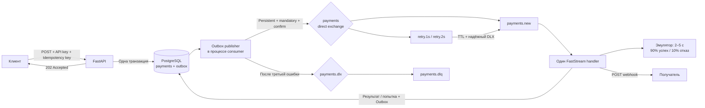
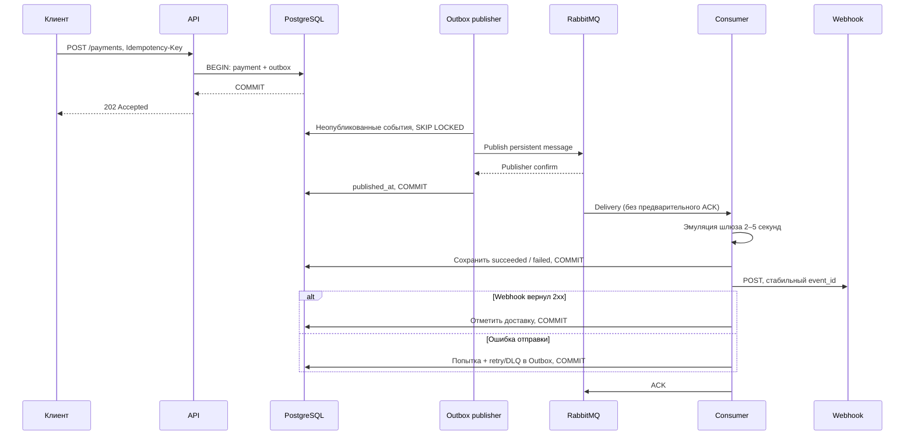
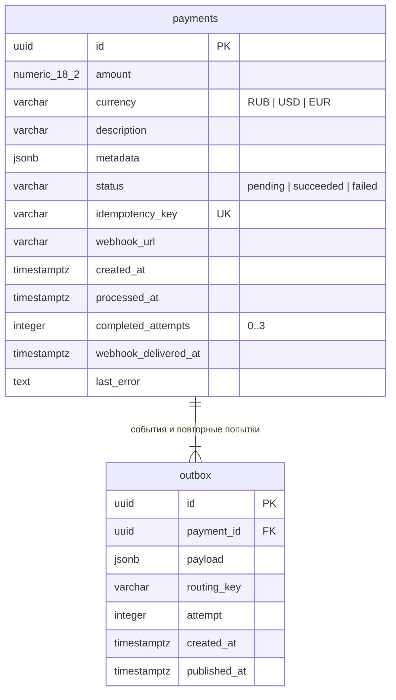

# Async Payments

[](https://github.com/ashromanov/test-task/actions/workflows/ci.yml)


**Асинхронный процессинг платежей с transactional outbox, идемпотентностью, устойчивыми retry и webhook.**

Запрос заканчивается после транзакции PostgreSQL. Один consumer обрабатывает платёж, сохраняет результат и уведомляет клиента. Недоступность RabbitMQ не мешает принимать платежи; события ждут восстановления в Outbox.

**[Открыть Swagger →](https://payments.2-26-150-15.sslip.io/docs)** · [CI/CD](https://github.com/ashromanov/test-task/actions) · [Нагрузочные тесты](performance/README.md)

В публичном демо нажмите **Authorize** и введите `demo-payments-public-key`. Это отдельный публичный ключ эмулятора: реальных списаний нет. Создание ограничено 5 запросами/с, burst 20. Адрес привязан к IP сервера; доступность зависит от его аренды (текущий срок — 07.10.2026, 16:23 МСК).

## Быстрый запуск

Нужны Docker Engine и Docker Compose **2.24.4+** (`!override` используется только в тестовом compose).

```bash
cp .env.example .env
docker compose up --build -d --wait
```

Swagger: **http://localhost:8000/docs**, локальный API-ключ: `local-development-key`. Перед внешней публикацией замените пароли из примера.

```bash
docker compose logs -f consumer
docker compose ps
docker compose down          # данные сохраняются в named volumes
```

API применяет Alembic-миграции перед запуском. Consumer стартует после готовности API и RabbitMQ. PostgreSQL и RabbitMQ не публикуют порты в основном окружении; API слушает только `127.0.0.1`.

## API

| Метод | Путь | Результат |
|---|---|---|
| `POST` | `/api/v1/payments` | `202 Accepted`: ID, текущий статус, дата создания |
| `GET` | `/api/v1/payments/{payment_id}` | `200`: подробности платежа и отметка доставки webhook |
| `GET` | `/health` | `200`: API и PostgreSQL доступны |

Все перечисленные маршруты требуют `X-API-Key`. Документация `/docs` и `/openapi.json` открыта.

```bash
curl -sS http://localhost:8000/api/v1/payments \
  -H 'X-API-Key: local-development-key' \
  -H 'Idempotency-Key: order-2026-001' \
  -H 'Content-Type: application/json' \
  -d '{
    "amount": "1299.90",
    "currency": "RUB",
    "description": "Заказ № 001",
    "metadata": {"order_id": "001"},
    "webhook_url": "https://example.com/payment-callback"
  }'
```

```json
{
  "payment_id": "a6a34b3b-6d93-43d1-9f51-98cb67ddf94e",
  "status": "pending",
  "created_at": "2026-10-06T12:00:00Z"
}
```

`example.com/payment-callback` — иллюстрация URL, а не рабочий получатель. Укажите собственный публичный HTTP(S) endpoint, возвращающий `2xx`; для воспроизводимой проверки с локальным получателем используйте тестовое окружение ниже.

```bash
curl -sS http://localhost:8000/api/v1/payments/PAYMENT_ID \
  -H 'X-API-Key: local-development-key'
```

Сумма хранится как `NUMERIC(18,2)` и передаётся в ответах строкой, без потери точности через float. Допустимы положительные суммы с максимум двумя значащими десятичными знаками, валюты `RUB`, `USD`, `EUR`. Метаданные — JSON-объект, по умолчанию `{}`; описание — 1–1024 символа, ключ — 1–255, тело запроса — максимум 64 КиБ.

Повтор того же тела с тем же `Idempotency-Key` возвращает существующий платёж и не создаёт события. Сравнение учитывает нормализованную сумму и URL; порядок ключей JSON не важен. Изменение тела с тем же ключом возвращает `409`, неверные данные — `422`, отсутствующий/неверный API-ключ — `401`, неизвестный платёж — `404`.

## Как проходит платёж





### Гарантии и ограничения

- **Transactional outbox.** Платёж и событие создаются атомарно. Publisher использует `FOR UPDATE SKIP LOCKED`, подтверждения брокера и ошибку на возврат unroutable message. Ошибка публикации откатывает отметки; непубликовавшиеся события не удаляются и не имеют лимита повторов.
- **At-least-once.** Сбой после publisher confirm и до коммита допускает дубликат. Обработчик сериализует сообщения одного платежа и проверяет сохранённый результат, завершённую попытку и доставку webhook.
- **Три попытки всего:** первая, затем две повторные с минимальными задержками 1 и 2 секунды. Retry хранится в Outbox вместе с завершённой попыткой. TTL-очереди освобождают обработчик на время задержки; фактический интервал включает ожидание publisher и очереди.
- **Quorum queues + at-least-once DLX.** Очереди и exchanges durable, сообщения persistent. Пересылка из retry-очередей использует внутренние publisher confirms. Single-node RabbitMQ сохраняет сообщения при рестарте, но не обеспечивает отказоустойчивость целого сервера.
- **DLQ.** После третьей ошибки сообщение публикуется в `payments.dlq` с причиной. Ошибка уведомления не меняет результат проведённого платежа. При трёх технических ошибках самого эмулятора платёж становится failed, а недоставленное уведомление остаётся задачей разбирательства по DLQ.
- **Отказ шлюза — бизнес-результат.** Случайные 10% отказов сразу дают `failed` и обычный webhook; они не повторяются как техническая ошибка.
- **Сбой БД — инфраструктурная ошибка.** Пока нельзя записать результат и следующую попытку, сообщение не подтверждается. Работа не теряется и бюджет webhook-попыток не расходуется.
- **Webhook тоже at-least-once.** При сбое после HTTP `2xx`, но до коммита отметки клиент может получить повтор. Получатель должен дедуплицировать `event_id`; он также передаётся в заголовке `Idempotency-Key`. Exactly-once через HTTP не обещается.

## Webhook

```json
{
  "event_id": "a6a34b3b-6d93-43d1-9f51-98cb67ddf94e",
  "event_type": "payment.processed",
  "payment_id": "a6a34b3b-6d93-43d1-9f51-98cb67ddf94e",
  "status": "succeeded",
  "amount": "1299.90",
  "currency": "RUB",
  "description": "Заказ № 001",
  "metadata": {"order_id": "001"},
  "created_at": "2026-10-06T12:00:00+00:00",
  "processed_at": "2026-10-06T12:00:03+00:00"
}
```

Успех — любой `2xx`, таймаут — 5 секунд. HTTP-соединения переиспользуются. Ответ получателя не загружается целиком. Redirects запрещены; DNS-resolver проверяет адреса, фактически передаваемые connector, чтобы исключить внутренние адреса и DNS rebinding. Literal IPv4/IPv6 проверяются отдельно.

Для собственного доверенного локального получателя можно явно задать `WEBHOOK_ALLOWED_HOSTS`. В публичном production compose исключения принудительно отключены. Webhook не подписывается отдельным секретом: такой контракт не входит в задание; публичный демо-ключ не подходит для проверки подлинности уведомлений.

## База данных



Уникальны `idempotency_key` и пара `(payment_id, attempt)` в Outbox. Частичный индекс `WHERE published_at IS NULL` ускоряет выборку очереди публикации. CHECK-ограничения защищают сумму, валюту, статус, число попыток и согласованность `processed_at`. Даты — UTC.

```bash
docker compose exec api alembic current
docker compose exec postgres psql -U payments -d payments \
  -c 'SELECT status, count(*) FROM payments GROUP BY status;'
docker compose exec rabbitmq rabbitmqctl list_queues name messages_ready messages_unacknowledged
```

Опубликованные записи Outbox сохраняются для аудита. Для долгой эксплуатации потребуется политика архивирования/retention; скрытого удаления финансовых данных нет.

## Настройки и производительность

| Переменная | Значение по умолчанию | Назначение |
|---|---|---|
| `API_KEY` | Обязательная, минимум 16 символов | Статический ключ |
| `POSTGRES_PASSWORD`, `RABBITMQ_PASSWORD` | Обязательные в Compose | Пароли инфраструктуры |
| `API_PORT` | `8000` | Локальный порт API |
| `CONSUMER_PREFETCH` | `16` | Максимум одновременно неподтверждённых сообщений |
| `DB_POOL_SIZE` | `5` на процесс | Пул без overflow |
| `OUTBOX_BATCH_SIZE` | `100` | Пачка публикации |
| `OUTBOX_POLL_INTERVAL` | `0.25` с | Проверка Outbox; при простое backoff до 2 с |
| `WEBHOOK_TIMEOUT` | `5` с | Полный таймаут отправки |
| `WEBHOOK_ALLOWED_HOSTS` | Пусто | Явные исключения для локальных получателей |
| `DEMO_MODE` | `false`; production `true` | Ограничение частоты создания |

Один API-процесс и один consumer, `uvloop`, короткие транзакции без удержания соединений при ожидании шлюза/webhook. Runtime-образ не содержит Locust, Ruff и dev-зависимости. Сборка использует `uv.lock`, кэш зависимостей, готовые wheels и предварительную компиляцию bytecode. RabbitMQ ограничен двумя Erlang scheduler threads.

При задержке шлюза в среднем 3.5 секунды и prefetch 16 расчётный потолок эмуляции около 4.6 платежа/с до учёта накладных расходов. HTTP throughput и полная скорость обработки измеряются отдельно. **[Воспроизводимые замеры и исходные CSV →](performance/README.md)**

Consumer рассчитан на один экземпляр: локальные блокировки защищают конкурирующие дубликаты внутри процесса. Перед горизонтальным масштабированием нужна межпроцессная ownership/idempotency-механика; для реального шлюза также нужен его собственный idempotency key. Вертикально параллелизм регулируется prefetch.

## Проверки

```bash
uv sync --frozen
uv run ruff check payments migrations tests load
uv run ruff format --check payments migrations tests load
uv run python -m unittest tests.test_unit -v

# Изолированный проект, свои volumes, API :18000 и receiver :18081.
docker compose -f compose.yaml -f compose.test.yaml up --build -d --wait
uv run python -m unittest tests.test_integration -v
docker compose -f compose.yaml -f compose.test.yaml down -v
```

Интеграционные проверки реально останавливают/запускают PostgreSQL и RabbitMQ **только тестового проекта**: конкурентные дубли, конфликт тела, оба исхода шлюза, повтор в процессе обработки, ошибка маршрутизации publisher, retry 1/2 секунды, DLQ, падение consumer и восстановление Outbox после сбоя брокера.

## CI/CD

На push в `main` и pull request GitHub Actions запускает Ruff, unit-тесты и интеграционные проверки в Docker. Только успешный `main` доставляется по SSH; сервер собирает образ с тегом commit SHA, применяет миграции, ждёт healthcheck и регистрации consumer. Проверяется внешний OpenAPI.

Deploy выполняется последовательно. SSH-ключ хранится в GitHub Secrets; host key закреплён, а отдельный ключ на сервере ограничен forced command `deploy <SHA>`. Пароли БД остаются в `/opt/async-payments/.env` с правами `0600`.

| Secret | Назначение |
|---|---|
| `DEPLOY_HOST` | IP сервера |
| `DEPLOY_SSH_KEY` | Отдельный приватный ключ доставки |
| `DEPLOY_KNOWN_HOSTS` | Проверенные SSH host keys |

На сервере: `/opt/async-payments/releases/<SHA>`, ссылка `current` указывает на успешно запущенный релиз. При неуспешной готовности возвращается предыдущий образ приложения. **Миграции БД автоматически не откатываются**: изменения схемы должны сохранять совместимость с предыдущим релизом.

Отдельный workflow **Optional load test** запускается вручную и сохраняет HTML/CSV в Actions artifacts. Нагрузка направлена на изолированный стек без публичного rate limit. Существующий Caddy обслуживает отдельный hostname с автоматически обновляемым TLS-сертификатом; основной Compose работает и без reverse proxy.
